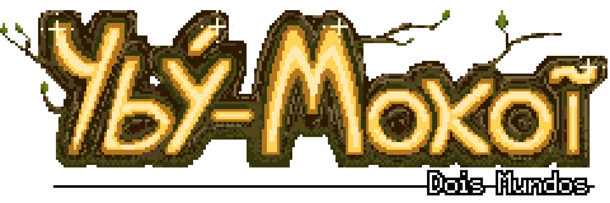

 

<h1>Ybý-Mokoĩ</h1>

 

<h2><strong>Introdução</strong></h2>

Ybý-Mokoĩ (Duas Terras) é um jogo action RPG com temática indígena amazônica inspirado na mitologia tupi guarani, com itens colecionáveis (guaraná, açaí e erva-mate) que são usados para recuperar HP, mana e estâmina. Os embates com as criaturas minions e bosses que fazem parte da mitologia tupi guarani e a evolução do personagem ao vencer os bosses fazem o jogo ser divertido e educativo.

Este projeto foi desenvolvido para a disciplina "<strong>Projetos e Implementação de jogos 2D</strong>"

<strong>Professores:</strong>
<ul>
	<li>Geber Ramalho</li>
	<li>Átila Malta</li>
</ul>
 
<strong>CIn - UFPE 2021.2</strong>

<strong>Plataforma(s):</strong> PC
 

<h2><strong>Acesso</strong></h2>
<strong>Download do jogo: </strong> <a href="https://github.com/Lrs50/Projeto_Games_2D/raw/main/Yby-Mokoi%20v1.2.zip"> Clique aqui</a>

<strong>Instruções para jogar: </strong>
<ul>
	<li>Após o download do jogo</li>
	<li>Descompacte o arquivo .zip</li>
	<li>Execute o arquivo "ybymokoi.exe"</li>
	<li>Divirta-se!!</li>
</ul>

<h1><strong>Equipe</strong></h1>
<strong>Diretor</strong>
<ul>
	<li>Lucas Reis</li>
</ul>
 
<strong>Programadores </strong>
<ul>
	<li>Gabriel Rocha</li>
	<li>João Victor Oliveira</li>
	<li>Lucas Reis</li>
	<li>Luís Carlos</li>
</ul>
 
<strong>Design </strong>
<ul>
	<li>Bruno Mesquita</li>
	<li> Gabriel Rocha</li>
</ul>
 
<strong>SFX</strong>
<ul>
	<li>Ramom Santos</li>
</ul>
 
<strong>História</strong>
<ul>
	<li>Lucas Reis</li>
</ul>
 

 

 
